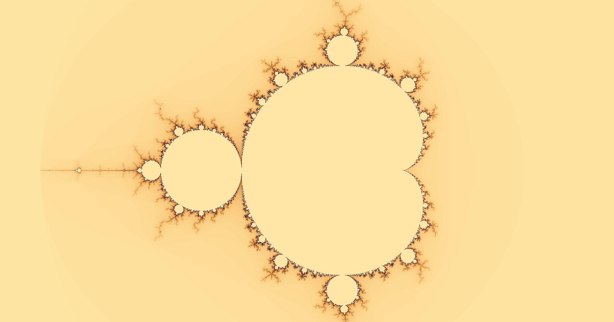
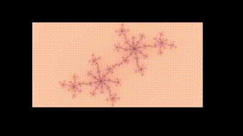
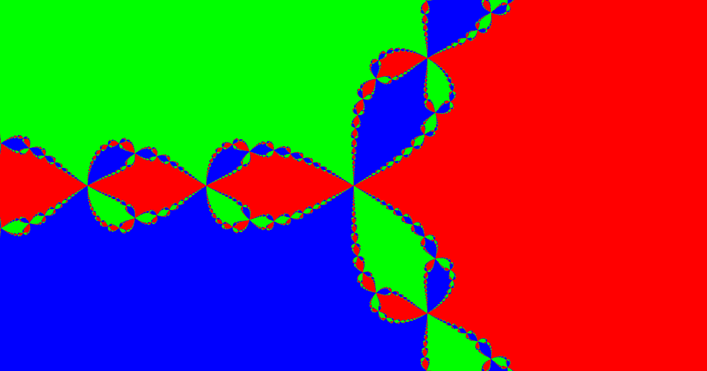
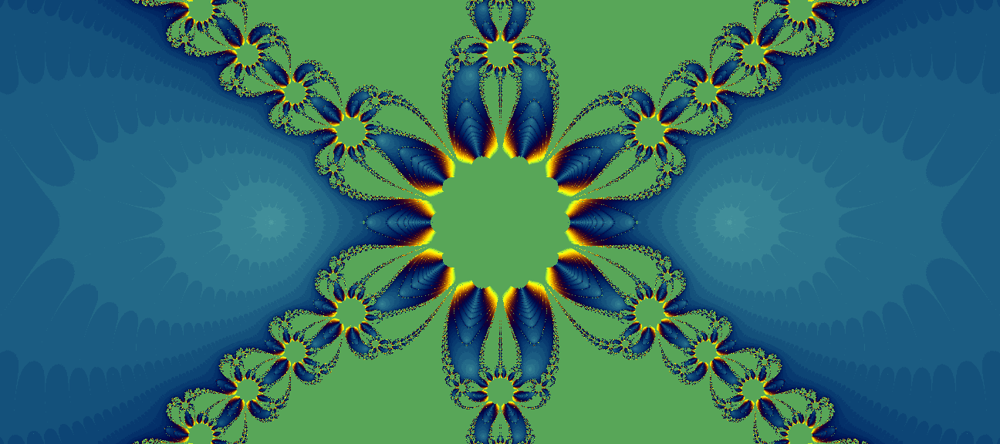

# Fractal-Viewer
My first (public) project that renders multiple fractals using GPU acceleration.

This was my first project in cuda, so it is very rough around the edges. It was developed to learn how basic cuda kernelss work and to learn about Computer Graphics.

if you want to render it using precise mode, change the variable "precise" to be true in __Viewer.cuh__. To change the color, edit the color under __Newtons.cuh__ according ti [this](https://iquilezles.org/articles/palettes/).

<h2> General Controls : </h2>

Controls : Use __Mouse Wheel__ to control the zoom. __CLick and Drag__ to move the fractal around. 

Press __P__ to take a screenshot.

<h2> Fractal Controls : </h2>

<h4> Number 1 - Mandelbrot set <h4>

Colored Rendering of the [MandelBrot Set](https://en.wikipedia.org/wiki/Mandelbrot_set)

<h4> Numbers 2/3 - Julia Set <h4>

2 Renderings of the [Julia Set](https://en.wikipedia.org/wiki/Julia_set)

One is where the real/complex portion is 1 - golden ration, while the other is c = −0.8 + 0.156i.

<h4> Number 4 - Animated Julia Set <h4>

Controls : Press __L__ To pause animation, __M__ To reverse animation, and hold __Left Shift__ to slow it down. 

A rendering for the julia set where the complex portion is 0.7885e^ia, where a goes from 0-2pi.

Preview : 

Full Version :

<h4> Number 5 - Tri Colored Newton Fractal <h4>

[Newton Fractal](https://en.wikipedia.org/wiki/Newton_fractal) that is colored based on which of the three roots it reaches for p(z) = z^3 -1, based on newtons method.

 

<h4> Number 6 - Newtons Fractal <h4>

Fractal that took the longest; it is a [Newton fractal](https://en.wikipedia.org/wiki/Newton_fractal) that is colored by the amount of loops it takes until it reaches a root. 

The formula used is p(z) = z5*Sin(Z) - 1, with a = 1.

